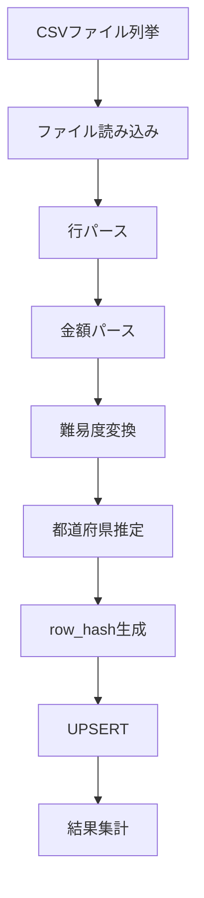
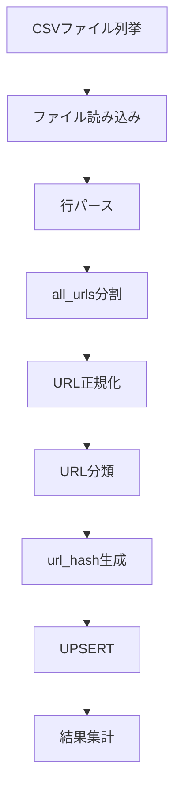
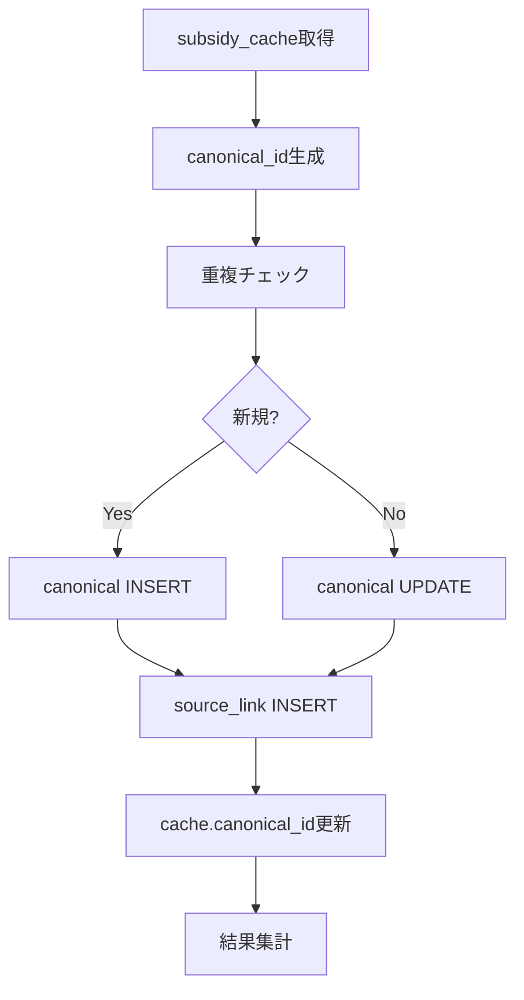
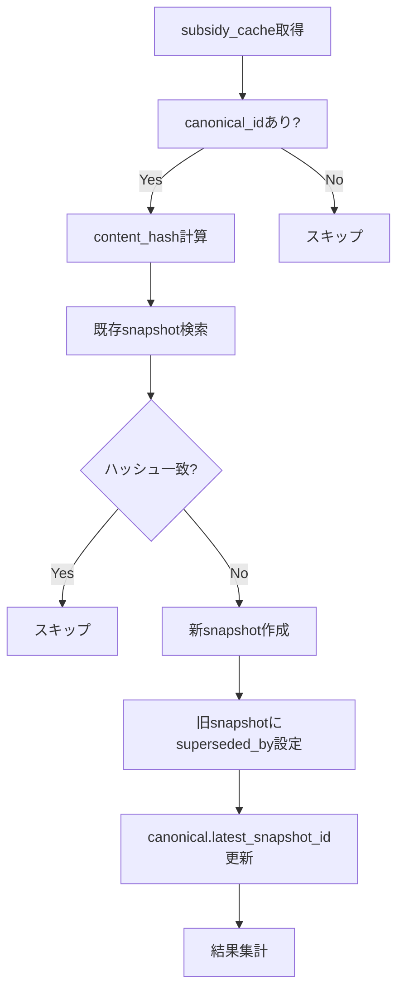

# SSOT統合スクリプト設計仕様

## 概要

本ドキュメントは、補助金データのSSOT（Single Source of Truth）統合に必要な4つのスクリプトの設計仕様を定義する。

### スクリプト一覧

| スクリプト | 目的 | 入力 | 出力先テーブル |
|-----------|------|------|---------------|
| `import-izumi.mjs` | izumi詳細CSV取り込み | data/izumi/details/*.csv | izumi_subsidies |
| `import-izumi-urls.mjs` | izumi URL展開 | data/izumi/izumi_support_urls_*.csv | izumi_urls |
| `backfill-jgrants-canonical.mjs` | jGrants→canonical移行 | subsidy_cache | subsidy_canonical, subsidy_source_link |
| `snapshot-jgrants.mjs` | snapshot生成 | subsidy_cache | subsidy_snapshot |

### 依存関係（実行順序）

```
1. import-izumi.mjs (izumi_subsidies投入)
   ↓
2. import-izumi-urls.mjs (izumi_urls展開)
   ↓
3. backfill-jgrants-canonical.mjs (canonical/link生成)
   ↓
4. snapshot-jgrants.mjs (snapshot生成)
```

---

## 1. import-izumi.mjs

### 目的
izumi詳細CSV（90ファイル、約18,655件）をD1の`izumi_subsidies`テーブルに投入する。

### 入力データ

**CSVファイル**: `data/izumi/details/izumi_detail_*.csv`

**CSVカラム構造**:
```csv
policy_id,detail_url,title,issuer,area,publish_date,period,max_amount,difficulty,start_fee,success_fee,support_url,support_urls_all,error
```

**サンプルデータ**:
```csv
"28","https://j-izumi.com/policy/28/detail","小規模事業者経営改善資金等利子補給制度","","","","","","★☆☆☆☆","要相談","要相談","https://www.city.narita.chiba.jp/content/000058071.pdf","https://www.city.narita.chiba.jp/business/page152800_00001.html | https://www.city.narita.chiba.jp/content/000058071.pdf",""
```

### 処理フロー



### 変換ロジック

#### 金額パース (`parseMaxAmount`)
```javascript
/**
 * 金額テキストを数値に変換
 * @param {string} text - 元のテキスト（例: "30万円", "1億円", "5000円/回"）
 * @returns {number|null} - パース後の数値（円）
 */
function parseMaxAmount(text) {
  if (!text) return null;
  
  // 特殊パターン除外
  if (text.includes('要相談') || text.includes('なし')) return null;
  
  // 単位変換マップ
  const unitMap = {
    '億': 100000000,
    '千万': 10000000,
    '百万': 1000000,
    '万': 10000,
    '千': 1000
  };
  
  // 正規表現でパース
  // "30万円" → 300000
  // "1億円" → 100000000
  // "5000円/回" → 5000（/回は無視）
  
  let value = text.replace(/[,，]/g, '');  // カンマ除去
  
  for (const [unit, multiplier] of Object.entries(unitMap)) {
    const regex = new RegExp(`([0-9.]+)\\s*${unit}`);
    const match = value.match(regex);
    if (match) {
      return Math.round(parseFloat(match[1]) * multiplier);
    }
  }
  
  // 単位なしの数値
  const numMatch = value.match(/([0-9,]+)\s*円/);
  if (numMatch) {
    return parseInt(numMatch[1].replace(/,/g, ''), 10);
  }
  
  return null;
}
```

#### 難易度変換 (`parseDifficulty`)
```javascript
/**
 * 難易度テキストを数値に変換
 * @param {string} text - 元のテキスト（例: "★☆☆☆☆"）
 * @returns {number} - 1-5 の数値
 */
function parseDifficulty(text) {
  if (!text) return 1;
  const stars = (text.match(/★/g) || []).length;
  return Math.max(1, Math.min(5, stars));
}
```

#### 都道府県推定 (`extractPrefectureCode`)
```javascript
/**
 * URLまたはissuerから都道府県コードを推定
 * @param {string} url - support_url
 * @param {string} issuer - 実施機関名
 * @returns {string|null} - 都道府県コード（01-47）
 */
function extractPrefectureCode(url, issuer) {
  // URLドメインから推定
  const cityMatch = url?.match(/\.city\.([a-z]+)\./);
  const prefMatch = url?.match(/\.pref\.([a-z]+)\./);
  
  // 都道府県マッピング（一部）
  const prefectureMap = {
    'hokkaido': '01', 'aomori': '02', 'iwate': '03', 'miyagi': '04',
    'akita': '05', 'yamagata': '06', 'fukushima': '07', 'ibaraki': '08',
    'tochigi': '09', 'gunma': '10', 'saitama': '11', 'chiba': '12',
    'tokyo': '13', 'kanagawa': '14', 'niigata': '15', 'toyama': '16',
    // ... 以下略
  };
  
  // 市区町村から都道府県を逆引き
  const cityToPrefecture = {
    'adachi': '13', 'narita': '12', 'sapporo': '01', 'yokohama': '14',
    // ... 以下略（必要に応じて拡充）
  };
  
  if (cityMatch && cityToPrefecture[cityMatch[1]]) {
    return cityToPrefecture[cityMatch[1]];
  }
  if (prefMatch && prefectureMap[prefMatch[1]]) {
    return prefectureMap[prefMatch[1]];
  }
  
  return null;  // 推定不可
}
```

#### row_hash生成
```javascript
/**
 * 行データのハッシュを生成（変更検知用）
 * @param {object} row - CSV行データ
 * @returns {string} - MD5ハッシュ
 */
function generateRowHash(row) {
  const hashSource = [
    row.policy_id,
    row.title,
    row.issuer,
    row.max_amount,
    row.support_url
  ].join('|');
  
  return crypto.createHash('md5').update(hashSource).digest('hex');
}
```

### SQL操作

```sql
-- UPSERT: policy_idが存在すれば更新、なければ挿入
INSERT INTO izumi_subsidies (
  id, policy_id, detail_url, title, issuer, area, prefecture_code,
  publish_date, period, max_amount_text, max_amount_value,
  difficulty, difficulty_level, start_fee, success_fee,
  support_url, support_urls_all, imported_at, updated_at
) VALUES (?, ?, ?, ?, ?, ?, ?, ?, ?, ?, ?, ?, ?, ?, ?, ?, ?, datetime('now'), datetime('now'))
ON CONFLICT(policy_id) DO UPDATE SET
  detail_url = excluded.detail_url,
  title = excluded.title,
  issuer = excluded.issuer,
  area = excluded.area,
  prefecture_code = excluded.prefecture_code,
  publish_date = excluded.publish_date,
  period = excluded.period,
  max_amount_text = excluded.max_amount_text,
  max_amount_value = excluded.max_amount_value,
  difficulty = excluded.difficulty,
  difficulty_level = excluded.difficulty_level,
  start_fee = excluded.start_fee,
  success_fee = excluded.success_fee,
  support_url = excluded.support_url,
  support_urls_all = excluded.support_urls_all,
  updated_at = datetime('now');
```

### 出力

```javascript
{
  totalFiles: 90,
  totalRows: 18655,
  inserted: 18000,
  updated: 655,
  skipped: 0,
  errors: [],
  duration: 45000,  // ms
  timestamp: '2026-02-01T10:00:00Z'
}
```

### エラーハンドリング

| エラー種別 | 対応 |
|-----------|------|
| CSVパースエラー | 行スキップ、エラーログ記録 |
| 必須項目欠落（policy_id, title） | 行スキップ、エラーログ記録 |
| DB接続エラー | リトライ（最大3回）、失敗時は中断 |
| 金額パース失敗 | null設定、警告ログ |

### コマンドライン

```bash
# ローカルD1実行
npx wrangler d1 execute subsidy-matching-production --local --file=migrations/0111_canonical_snapshot_izumi.sql
node scripts/import-izumi.mjs --local

# 本番D1実行
node scripts/import-izumi.mjs --production

# ドライラン
node scripts/import-izumi.mjs --local --dry-run

# 特定ファイルのみ
node scripts/import-izumi.mjs --local --file=data/izumi/details/izumi_detail_200.csv
```

---

## 2. import-izumi-urls.mjs

### 目的
izumi support_urls CSV（35ファイル、約17,032件）をD1の`izumi_urls`テーブルに展開する。

### 入力データ

**CSVファイル**: `data/izumi/izumi_support_urls_*.csv`

**CSVカラム構造**:
```csv
policy_id,primary_url,all_urls
```

**サンプルデータ**:
```csv
"56","https://www.city.adachi.tokyo.jp/documents/20407/r7titekizaisannannai.pdf","https://www.city.adachi.tokyo.jp/s-shinko/shigoto/chushokigyo/25chitekizaisan-josei.html | https://www.city.adachi.tokyo.jp/documents/20407/r7titekizaisannannai.pdf"
```

### 処理フロー



### 変換ロジック

#### URL分割と正規化
```javascript
/**
 * all_urlsを個別URLに分割
 * @param {string} allUrls - パイプ区切りのURL文字列
 * @returns {string[]} - URLの配列
 */
function splitUrls(allUrls) {
  if (!allUrls) return [];
  return allUrls.split('|').map(u => u.trim()).filter(u => u.length > 0);
}

/**
 * URLを正規化
 * @param {string} url - 元のURL
 * @returns {string} - 正規化されたURL
 */
function normalizeUrl(url) {
  try {
    const parsed = new URL(url);
    // フラグメント(#...)は除去
    parsed.hash = '';
    // 末尾スラッシュ統一
    let normalized = parsed.href;
    if (normalized.endsWith('/') && parsed.pathname !== '/') {
      normalized = normalized.slice(0, -1);
    }
    return normalized;
  } catch {
    return url.trim();
  }
}
```

#### URL分類 (`classifyUrlType`)
```javascript
/**
 * URLタイプを分類
 * @param {string} url - URL
 * @returns {string} - 'html', 'pdf', 'unknown'
 */
function classifyUrlType(url) {
  const lower = url.toLowerCase();
  if (lower.endsWith('.pdf')) return 'pdf';
  if (lower.endsWith('.html') || lower.endsWith('.htm')) return 'html';
  if (lower.includes('.pdf?') || lower.includes('.pdf#')) return 'pdf';
  
  // 拡張子なしはHTMLと推定
  const pathname = new URL(url).pathname;
  if (!pathname.includes('.') || pathname.endsWith('/')) return 'html';
  
  return 'unknown';
}
```

#### ドメイン抽出
```javascript
/**
 * URLからドメインを抽出
 * @param {string} url - URL
 * @returns {string} - ドメイン
 */
function extractDomain(url) {
  try {
    return new URL(url).hostname;
  } catch {
    return '';
  }
}
```

#### url_hash生成
```javascript
/**
 * URLのハッシュを生成（重複排除用）
 * @param {string} url - 正規化されたURL
 * @returns {string} - MD5ハッシュ
 */
function generateUrlHash(url) {
  return crypto.createHash('md5').update(url).digest('hex');
}
```

### SQL操作

```sql
-- UPSERT: (policy_id, url_hash)が存在すれば更新、なければ挿入
INSERT INTO izumi_urls (
  id, policy_id, url, url_hash, url_type, is_primary, domain,
  crawl_status, created_at, updated_at
) VALUES (?, ?, ?, ?, ?, ?, ?, 'pending', datetime('now'), datetime('now'))
ON CONFLICT(policy_id, url_hash) DO UPDATE SET
  url = excluded.url,
  url_type = excluded.url_type,
  is_primary = excluded.is_primary,
  domain = excluded.domain,
  updated_at = datetime('now');
```

### 出力

```javascript
{
  totalFiles: 35,
  totalPolicies: 17032,
  totalUrls: 45000,  // 展開後の総URL数
  inserted: 44000,
  updated: 1000,
  skipped: 0,
  duplicates: 500,  // 同一URL重複除外
  errors: [],
  duration: 30000,
  timestamp: '2026-02-01T10:05:00Z'
}
```

### コマンドライン

```bash
# ローカルD1実行
node scripts/import-izumi-urls.mjs --local

# 本番D1実行
node scripts/import-izumi-urls.mjs --production

# ドライラン
node scripts/import-izumi-urls.mjs --local --dry-run
```

---

## 3. backfill-jgrants-canonical.mjs

### 目的
既存の`subsidy_cache`（jGrantsデータ）を`subsidy_canonical`および`subsidy_source_link`へ安全に移行する。

### 入力データ

**テーブル**: `subsidy_cache`

**対象カラム**:
- id, source, title, subsidy_max_limit, subsidy_rate
- target_area_search, target_industry, target_number_of_employees
- acceptance_start_datetime, acceptance_end_datetime
- detail_json

### 処理フロー



### canonical_id生成ルール

```javascript
/**
 * canonical_idを生成
 * 
 * 生成ルール:
 * 1. jGrants IDがある場合: 'jg-{jgrants_id}'
 * 2. issuer + title正規化: '{issuer_code}-{normalized_title_hash}'
 * 
 * @param {object} cacheRow - subsidy_cacheの行
 * @returns {string} - canonical_id
 */
function generateCanonicalId(cacheRow) {
  // jGrantsの場合、IDをそのまま利用
  if (cacheRow.source === 'jgrants' && cacheRow.id) {
    return `jg-${cacheRow.id}`;
  }
  
  // その他ソースの場合
  const normalizedTitle = normalizeTitle(cacheRow.title);
  const titleHash = crypto.createHash('md5')
    .update(normalizedTitle)
    .digest('hex')
    .substring(0, 8);
  
  const issuerCode = extractIssuerCode(cacheRow) || 'unknown';
  return `${issuerCode}-${titleHash}`;
}

/**
 * タイトルを正規化
 */
function normalizeTitle(title) {
  return title
    .toLowerCase()
    .replace(/[（）\(\)\[\]【】]/g, '')  // 括弧除去
    .replace(/[　\s]+/g, '')              // 空白除去
    .replace(/令和\d+年度?/g, '')         // 年度除去
    .replace(/第\d+[次回期]/g, '');       // 回次除去
}
```

### issuer_code抽出

```javascript
/**
 * detail_jsonからissuer_codeを抽出
 */
function extractIssuerCode(cacheRow) {
  if (!cacheRow.detail_json) return null;
  
  try {
    const detail = JSON.parse(cacheRow.detail_json);
    const agency = detail.implementing_agency || detail.issuer;
    
    if (!agency) return null;
    
    // 機関名→コード変換マップ（部分一致）
    const agencyMap = {
      '経済産業省': 'meti',
      '中小企業庁': 'smea',
      '厚生労働省': 'mhlw',
      '農林水産省': 'maff',
      '環境省': 'env',
      '総務省': 'mic',
      '国土交通省': 'mlit',
      '東京都': 'tokyo',
      // ... 以下略
    };
    
    for (const [name, code] of Object.entries(agencyMap)) {
      if (agency.includes(name)) return code;
    }
    
    // マッチしない場合はハッシュ
    return crypto.createHash('md5')
      .update(agency)
      .digest('hex')
      .substring(0, 6);
  } catch {
    return null;
  }
}
```

### SQL操作

```sql
-- Step 1: canonical INSERT
INSERT INTO subsidy_canonical (
  id, name, name_normalized, issuer_code, issuer_name, prefecture_code,
  latest_cache_id, first_seen_at, is_active, created_at, updated_at
) VALUES (?, ?, ?, ?, ?, ?, ?, datetime('now'), 1, datetime('now'), datetime('now'))
ON CONFLICT(id) DO UPDATE SET
  name = excluded.name,
  issuer_name = excluded.issuer_name,
  latest_cache_id = excluded.latest_cache_id,
  last_updated_at = datetime('now'),
  updated_at = datetime('now');

-- Step 2: source_link INSERT
INSERT INTO subsidy_source_link (
  id, canonical_id, source_type, source_id, match_type, match_score, verified, created_at
) VALUES (?, ?, 'jgrants', ?, 'system', 1.0, 1, datetime('now'))
ON CONFLICT(source_type, source_id) DO NOTHING;

-- Step 3: subsidy_cache.canonical_id更新
UPDATE subsidy_cache SET canonical_id = ? WHERE id = ?;
```

### バッチ処理

```javascript
const BATCH_SIZE = 100;

async function backfillCanonical(db) {
  let offset = 0;
  let totalProcessed = 0;
  
  while (true) {
    // バッチ取得
    const rows = await db.prepare(`
      SELECT * FROM subsidy_cache 
      WHERE canonical_id IS NULL
      ORDER BY id
      LIMIT ? OFFSET ?
    `).bind(BATCH_SIZE, offset).all();
    
    if (rows.results.length === 0) break;
    
    // トランザクション内で処理
    await db.batch(rows.results.map(row => {
      const canonicalId = generateCanonicalId(row);
      // ... INSERT/UPDATE文
    }));
    
    totalProcessed += rows.results.length;
    offset += BATCH_SIZE;
    
    console.log(`Processed: ${totalProcessed}`);
  }
  
  return { totalProcessed };
}
```

### 出力

```javascript
{
  totalCacheRows: 15000,
  canonicalCreated: 14500,
  canonicalUpdated: 500,
  sourceLinksCreated: 15000,
  cacheUpdated: 15000,
  errors: [],
  duration: 120000,
  timestamp: '2026-02-01T10:10:00Z'
}
```

### コマンドライン

```bash
# ローカル実行
node scripts/backfill-jgrants-canonical.mjs --local

# 本番実行（要確認）
node scripts/backfill-jgrants-canonical.mjs --production --confirm

# ドライラン
node scripts/backfill-jgrants-canonical.mjs --local --dry-run

# バッチサイズ指定
node scripts/backfill-jgrants-canonical.mjs --local --batch-size=50
```

---

## 4. snapshot-jgrants.mjs

### 目的
`subsidy_cache`のデータから`subsidy_snapshot`を生成し、時点データを保存する。

### 入力データ

**テーブル**: `subsidy_cache`（canonical_id設定済み）

**対象カラム**:
- id, canonical_id, title
- acceptance_start_datetime, acceptance_end_datetime
- subsidy_max_limit, subsidy_rate
- target_area_search, target_industry
- detail_json

### 処理フロー



### content_hash計算

```javascript
/**
 * スナップショットのコンテンツハッシュを計算
 * 変更検知に使用する主要フィールドのみ
 */
function calculateContentHash(cacheRow, detailJson) {
  const hashSource = JSON.stringify({
    acceptance_start: cacheRow.acceptance_start_datetime,
    acceptance_end: cacheRow.acceptance_end_datetime,
    max_limit: cacheRow.subsidy_max_limit,
    rate: cacheRow.subsidy_rate,
    area: cacheRow.target_area_search,
    // detail_jsonの主要項目
    overview: detailJson?.overview?.substring(0, 500),
    requirements: detailJson?.application_requirements?.substring(0, 500),
    expenses: detailJson?.eligible_expenses?.substring(0, 500)
  });
  
  return crypto.createHash('md5').update(hashSource).digest('hex');
}
```

### snapshot生成

```javascript
/**
 * cacheRowからsnapshotを生成
 */
function createSnapshotFromCache(cacheRow) {
  let detailJson = null;
  try {
    detailJson = cacheRow.detail_json ? JSON.parse(cacheRow.detail_json) : null;
  } catch {}
  
  return {
    id: `snap-${cacheRow.id}-${Date.now()}`,
    canonical_id: cacheRow.canonical_id,
    source_link_id: null,  // 後で設定
    
    // 募集回情報
    round_key: extractRoundKey(detailJson),
    fiscal_year: detailJson?.fiscal_year,
    
    // 期間
    acceptance_start: cacheRow.acceptance_start_datetime,
    acceptance_end: cacheRow.acceptance_end_datetime,
    deadline_text: detailJson?.deadline,
    is_accepting: isCurrentlyAccepting(cacheRow),
    
    // 金額
    subsidy_max_limit: cacheRow.subsidy_max_limit,
    subsidy_min_limit: detailJson?.subsidy_min_limit,
    subsidy_rate: cacheRow.subsidy_rate,
    subsidy_rate_max: parseRateMax(cacheRow.subsidy_rate),
    
    // 対象
    target_area_codes: extractAreaCodes(cacheRow.target_area_search),
    target_area_text: cacheRow.target_area_search,
    target_industry_codes: extractIndustryCodes(cacheRow.target_industry),
    target_employee_text: cacheRow.target_number_of_employees,
    
    // URL・資料
    official_url: detailJson?.related_url || detailJson?.official_url,
    pdf_urls: JSON.stringify(detailJson?.pdfUrls || []),
    attachments: JSON.stringify(detailJson?.attachments || []),
    
    // 詳細
    detail_json: cacheRow.detail_json,
    
    // メタ
    content_hash: calculateContentHash(cacheRow, detailJson)
  };
}

/**
 * 現在受付中かどうか判定
 */
function isCurrentlyAccepting(cacheRow) {
  const now = new Date();
  const start = cacheRow.acceptance_start_datetime 
    ? new Date(cacheRow.acceptance_start_datetime) 
    : null;
  const end = cacheRow.acceptance_end_datetime 
    ? new Date(cacheRow.acceptance_end_datetime) 
    : null;
  
  if (!start && !end) return 0;
  if (start && now < start) return 0;
  if (end && now > end) return 0;
  return 1;
}
```

### SQL操作

```sql
-- Step 1: 既存snapshotの最新ハッシュ取得
SELECT content_hash FROM subsidy_snapshot
WHERE canonical_id = ? AND superseded_by IS NULL
ORDER BY snapshot_at DESC LIMIT 1;

-- Step 2: 新snapshot INSERT（ハッシュが異なる場合のみ）
INSERT INTO subsidy_snapshot (
  id, canonical_id, source_link_id, round_key, fiscal_year,
  acceptance_start, acceptance_end, deadline_text, is_accepting,
  subsidy_max_limit, subsidy_min_limit, subsidy_rate, subsidy_rate_max,
  target_area_codes, target_area_text, target_industry_codes, target_employee_text,
  official_url, pdf_urls, attachments, detail_json,
  snapshot_at, content_hash, created_at
) VALUES (?, ?, ?, ?, ?, ?, ?, ?, ?, ?, ?, ?, ?, ?, ?, ?, ?, ?, ?, ?, ?, datetime('now'), ?, datetime('now'));

-- Step 3: 旧snapshotにsuperseded_by設定
UPDATE subsidy_snapshot 
SET superseded_by = ?
WHERE canonical_id = ? AND id != ? AND superseded_by IS NULL;

-- Step 4: canonical.latest_snapshot_id更新
UPDATE subsidy_canonical 
SET latest_snapshot_id = ?, last_updated_at = datetime('now')
WHERE id = ?;
```

### 出力

```javascript
{
  totalCacheRows: 15000,
  snapshotsCreated: 14000,
  snapshotsSkipped: 1000,  // ハッシュ一致でスキップ
  superseded: 500,         // 旧snapshotを更新
  canonicalUpdated: 14000,
  errors: [],
  duration: 180000,
  timestamp: '2026-02-01T10:20:00Z'
}
```

### コマンドライン

```bash
# ローカル実行
node scripts/snapshot-jgrants.mjs --local

# 本番実行
node scripts/snapshot-jgrants.mjs --production

# 差分のみ（ハッシュ変更があるもののみ）
node scripts/snapshot-jgrants.mjs --local --diff-only

# 強制再生成
node scripts/snapshot-jgrants.mjs --local --force

# 特定canonical_idのみ
node scripts/snapshot-jgrants.mjs --local --canonical-id=jg-12345
```

---

## 共通仕様

### D1接続

```javascript
import { createClient } from '@libsql/client';

function createD1Client(isLocal) {
  if (isLocal) {
    return createClient({
      url: 'file:.wrangler/state/v3/d1/miniflare-D1DatabaseObject/xxx.sqlite'
    });
  }
  
  // 本番: wrangler d1 execute を使用
  return {
    async execute(sql, params) {
      // wrangler CLI経由で実行
    }
  };
}
```

### ログ出力

```javascript
const LOG_LEVELS = { DEBUG: 0, INFO: 1, WARN: 2, ERROR: 3 };

function log(level, message, data = {}) {
  const timestamp = new Date().toISOString();
  const line = JSON.stringify({ timestamp, level, message, ...data });
  console.log(line);
}
```

### エラー管理

```javascript
/**
 * エラーを update_failures に記録
 */
async function recordFailure(db, jobRunId, failure) {
  await db.prepare(`
    INSERT INTO update_failures (
      id, job_run_id, source_type, source_id, 
      failure_type, failure_code, failure_message, failure_url,
      created_at
    ) VALUES (?, ?, ?, ?, ?, ?, ?, ?, datetime('now'))
  `).bind(
    `fail-${Date.now()}-${Math.random().toString(36).substring(7)}`,
    jobRunId,
    failure.sourceType,
    failure.sourceId,
    failure.type,
    failure.code,
    failure.message,
    failure.url
  ).run();
}
```

### 実行順序チェック

```javascript
/**
 * 前提条件の検証
 */
async function checkPrerequisites(db, scriptName) {
  const checks = {
    'import-izumi.mjs': [],
    'import-izumi-urls.mjs': [
      { table: 'izumi_subsidies', minCount: 1, message: 'Run import-izumi.mjs first' }
    ],
    'backfill-jgrants-canonical.mjs': [
      { table: 'subsidy_cache', minCount: 1, message: 'subsidy_cache is empty' }
    ],
    'snapshot-jgrants.mjs': [
      { table: 'subsidy_canonical', minCount: 1, message: 'Run backfill-jgrants-canonical.mjs first' }
    ]
  };
  
  for (const check of checks[scriptName] || []) {
    const result = await db.prepare(`SELECT COUNT(*) as count FROM ${check.table}`).first();
    if (result.count < check.minCount) {
      throw new Error(check.message);
    }
  }
}
```

---

## 実行スケジュール（推奨）

### 初回セットアップ

```bash
# 1. マイグレーション適用
npx wrangler d1 execute subsidy-matching-production --local --file=migrations/0111_canonical_snapshot_izumi.sql

# 2. izumiデータ投入
node scripts/import-izumi.mjs --local
node scripts/import-izumi-urls.mjs --local

# 3. jGrantsバックフィル
node scripts/backfill-jgrants-canonical.mjs --local

# 4. snapshot生成
node scripts/snapshot-jgrants.mjs --local
```

### 定期更新（週次）

```bash
# izumi差分更新
node scripts/import-izumi.mjs --local --incremental

# snapshot更新（差分のみ）
node scripts/snapshot-jgrants.mjs --local --diff-only
```

---

## 参考: テーブル関連図

```
┌─────────────────┐
│ subsidy_cache   │ ← 既存（互換層）
│ (jGrants)       │
└────────┬────────┘
         │ backfill
         ▼
┌─────────────────┐      ┌─────────────────┐
│subsidy_canonical│──────│subsidy_source_  │
│ (恒久ID)        │      │link             │
└────────┬────────┘      │(jgrants/izumi)  │
         │               └─────────────────┘
         │ snapshot
         ▼
┌─────────────────┐
│subsidy_snapshot │ ← 時点データ
│ (期間/金額/URL) │
└─────────────────┘

┌─────────────────┐      ┌─────────────────┐
│ izumi_subsidies │──────│ izumi_urls      │
│ (policy_id)     │      │ (URL展開)       │
└─────────────────┘      └─────────────────┘
```

---

## 次のアクション

1. **マイグレーション適用**: `0111_canonical_snapshot_izumi.sql` をローカルD1に適用
2. **スクリプト実装**: 上記仕様に基づいて4スクリプトを実装
3. **テスト実行**: ローカルD1で全スクリプトを順次実行
4. **結果検証**: テーブル件数・整合性を確認
5. **本番適用**: 検証後、本番D1に適用
